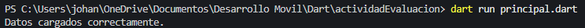
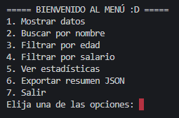
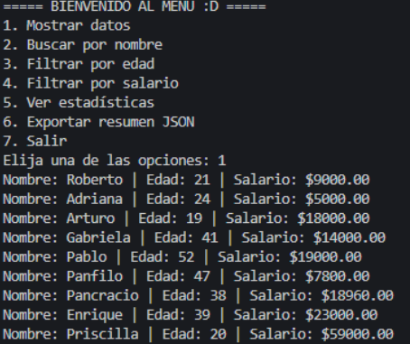
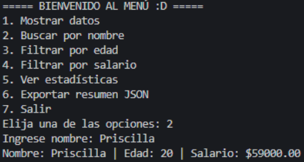
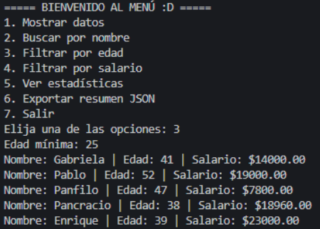
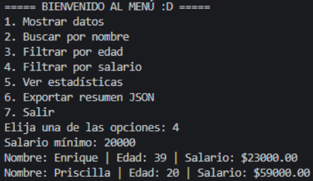
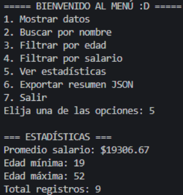
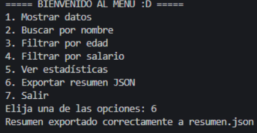
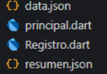
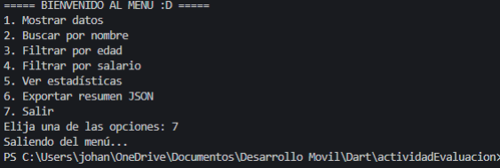

# Gestión y procesamiento de datos JSON

<p align="center">
  
  
  
  
</p>

---

# Objetivo del proyecto

Desarrollar una aplicación enfocada en la lectura, búsqueda, filtrado y exportación de información almacenada en archivos JSON utilizando Dart, permitiendo manipular datos de manera organizada y eficiente.

---

# Problema que resuelve

El proyecto demuestra cómo trabajar con estructuras JSON para gestionar información dinámica, facilitando la búsqueda y filtrado de registros mediante diferentes criterios y opciones interactivas.

---

# Tecnologías utilizadas

- Dart
- JSON
- Visual Studio Code
- GitHub

---

# Conceptos aplicados

- Programación orientada a objetos
- Lectura y escritura de archivos JSON
- Manejo de listas y mapas
- Filtrado de datos
- Validación de información
- Procesamiento de datos
- Estadísticas básicas
- Menús interactivos
- Manipulación de archivos

---

# Capturas de pantalla

## Carga correcta del archivo JSON

<p align="center">
  
</p>

Se muestra la carga exitosa del archivo `data.json` y el inicio correcto de la aplicación.

---

## Menú principal de la aplicación

<p align="center">
  
</p>

Menú interactivo con las diferentes opciones para consultar, filtrar y exportar datos.

---

## Visualización de registros

<p align="center">
  
</p>

Visualización completa de los registros almacenados en el archivo JSON.

---

## Búsqueda de personas

<p align="center">
  
</p>

Ejemplo de búsqueda de un registro específico utilizando el nombre de una persona.

---

## Filtrado por edad mínima

<p align="center">
  
</p>

Filtrado dinámico de registros utilizando una edad mínima definida por el usuario.

---

## Filtrado por salario mínimo

<p align="center">
  
</p>

Filtrado dinámico de registros utilizando un salario mínimo definido por el usuario.

---

## Estadísticas generadas

<p align="center">
  
</p>

Cálculo automático de estadísticas como salario promedio, edad mínima, edad máxima y total de registros.

---

## Exportación de resumen JSON

<p align="center">
  
</p>

Generación automática del archivo `resumen.json` con la información procesada.

---

## Creación de resumen JSON

<p align="center">
  
</p>

Resultado de exportar resumen JSON.

---

## Salida de la aplicación

<p align="center">
  
</p>

---

# Instrucciones de ejecución

Sigue estos pasos para clonar y ejecutar el proyecto en tu computadora local.

### 1. Requisitos previos
Asegúrate de tener instalado **Dart SDK** en tu sistema operativo. Puedes verificarlo ejecutando en tu terminal:
```bash
dart --version
```
**Nota**: En caso de que tengas Flutter instalado en tu equipo, ya tendrás acceso a Dart, simplemente ejecuta el comando anterior para verificar esto.

### 2. Clonar el proyecto
Descarga el código desde el repositorio de GitHub:
```bash
git clone https://github.com/John640512/PortafolioMoviles_JohanMarcelMorenoArreola.git
```

### 3. Entrar al proyecto
Entra a la siguiente ruta dentro del portafolio del proyecto:
```bash
cd Proyecto_01_GestionJSON/codigos
```

### 4. Ejecutar la aplicación
Ejecuta el programa utilizando:
```bash
dart run principal.dart
```

# Reflexión personal

## ¿Qué aprendí?

Durante este proyecto aprendí a trabajar con archivos JSON en Dart y entendí mejor cómo se puede almacenar y manipular información de manera organizada. Aprendí a leer archivos, recorrer registros, hacer búsquedas y aplicar filtros dependiendo de lo que el usuario necesitara consultar.

También comprendí mejor el manejo de listas, mapas y validaciones dentro del programa, además de practicar la lógica de programación para mostrar información correctamente en pantalla. Este proyecto me ayudó bastante a entender cómo se procesan datos dentro de una aplicación real.

## ¿Qué fue difícil?

La parte más difícil fue manejar correctamente la lectura y escritura de los archivos JSON, porque cualquier error pequeño en la estructura podía hacer que el programa dejara de funcionar correctamente. También me costó un poco validar las opciones del menú para evitar entradas incorrectas por parte del usuario.

Otro reto fue implementar los filtros de búsqueda y asegurarme de que mostraran únicamente los registros que cumplían con las condiciones establecidas, como edad mínima o salario mínimo.

## ¿Qué mejoraría?

Me gustaría mejorar este proyecto agregando una interfaz gráfica más moderna, ya que actualmente funciona desde consola. También sería buena idea añadir más filtros, ordenar los registros automáticamente y permitir exportar la información a otros formatos como Excel o CSV.

Además, en el futuro podría conectarse con una base de datos o una API para trabajar con información en tiempo real y hacer el sistema mucho más completo.
