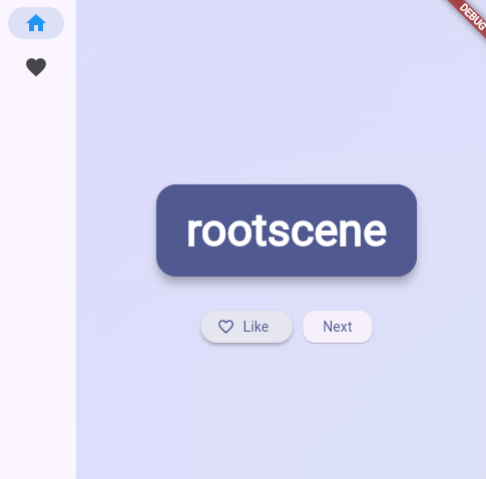
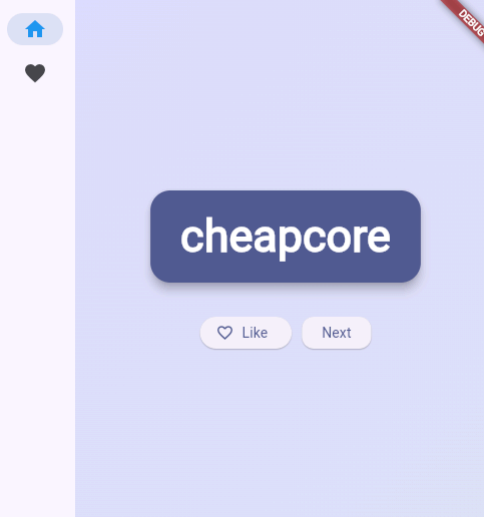
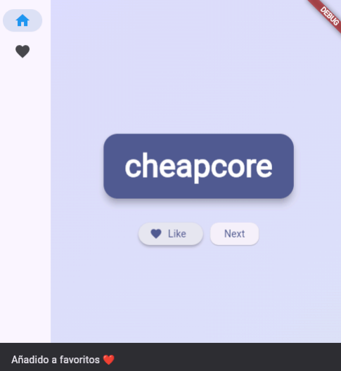
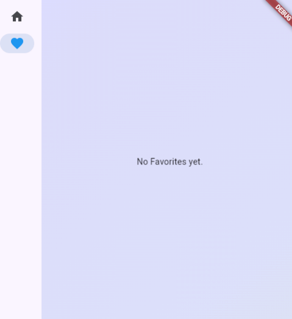
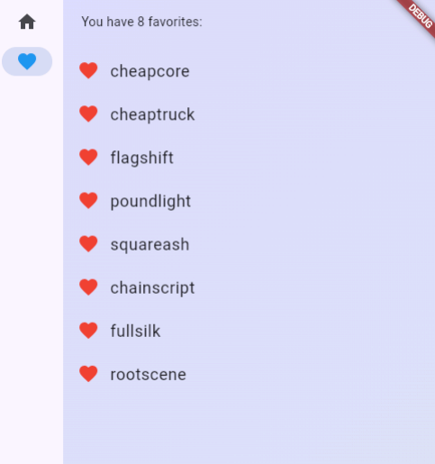
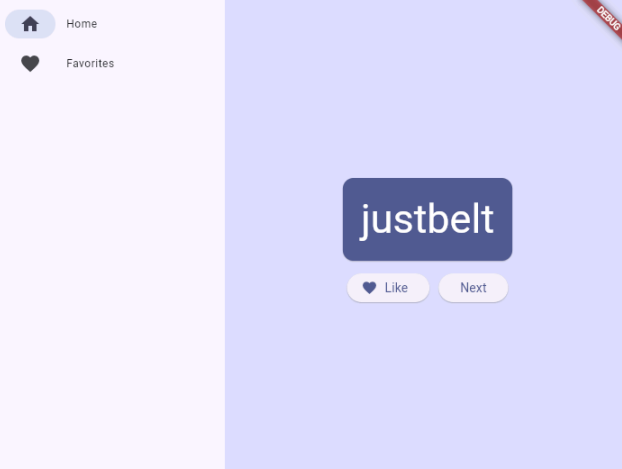

# Generador interactivo de palabras aleatorias en Flutter

<p align="center">
  
  
  
  
</p>

---

# Objetivo del proyecto

Desarrollar una aplicación interactiva en Flutter capaz de generar pares de palabras aleatorias, permitiendo al usuario marcar favoritos, navegar entre pantallas y experimentar el uso de widgets, estados y diseño responsivo dentro de una aplicación móvil moderna.

---

# Problema que resuelve

El proyecto demuestra cómo construir una aplicación dinámica utilizando Flutter, integrando navegación, manejo de estados, widgets reutilizables y diseño responsivo para mejorar la interacción del usuario dentro de una interfaz moderna e intuitiva.

---

# Tecnologías utilizadas

- Flutter
- Dart
- Visual Studio Code
- GitHub
- Provider
- Material Design

---

# Conceptos aplicados

- Programación orientada a objetos
- Widgets Stateless y Stateful
- Gestión de estados
- Navegación entre pantallas
- Uso de Provider
- Diseño responsivo
- Refactorización de widgets
- Manejo de listas
- Animaciones implícitas
- Uso de LayoutBuilder
- NavigationRail
- Accesibilidad en Flutter
- Diseño de interfaces modernas
- Hot Reload
- Uso de temas y estilos

---

# Capturas de pantalla

## Pantalla principal

<p align="center">
  
</p>

Vista principal de la aplicación mostrando la generación de palabras aleatorias.

---

## Generación de nuevas palabras

<p align="center">
  
</p>

Uso del botón "Next" para generar nuevos pares de palabras dinámicamente.

---

## Agregar palabras favoritas

<p align="center">
  
</p>

Adición de palabras a la lista de favoritos mediante el botón Like.

---

## Página de favoritos vacía

<p align="center">
  
</p>

Pantalla de favoritos sin elementos agregados.

---

## Lista de favoritos

<p align="center">
  
</p>

Visualización de palabras almacenadas como favoritas.

---

## Diseño responsivo

<p align="center">
  
</p>

Adaptación automática de la interfaz según el tamaño de pantalla.

---

## Interfaz mejorada

<p align="center">
  
</p>

Aplicación con mejoras visuales como degradados, sombras, botones personalizados y animaciones.

---

# Instrucciones de ejecución

Sigue estos pasos para clonar y ejecutar el proyecto en tu computadora local.

### 1. Requisitos previos

Asegúrate de tener instalado **Flutter** en tu sistema operativo. Puedes verificarlo ejecutando:

```bash
flutter doctor
```

**Nota:** Flutter ya incluye Dart automáticamente.

---

### 2. Clonar el proyecto

Descarga el repositorio desde GitHub:

```bash
git clone https://github.com/John640512/PortafolioMoviles_JohanMarcelMorenoArreola.git
```

---

### 3. Entrar al proyecto

Accede a la carpeta correspondiente:

```bash
cd Proyecto_02_GeneradorPalabrasAleatorias/codigos
```

---

### 4. Descargar dependencias (Obligatorio)

Reconstruye el entorno del proyecto ejecutando:

```bash
flutter pub get
```

---

### 5. Ejecutar la aplicación

Inicia la aplicación con:

```bash
flutter run
```

Selecciona el dispositivo deseado (Chrome, emulador o dispositivo físico).

---

### 6. Ejecutar directamente en navegador web

Si deseas abrir la aplicación directamente en Chrome:

```bash
flutter run -d chrome
```

---

# Reflexión personal

## ¿Qué aprendí?

Durante este proyecto aprendí mucho más sobre el funcionamiento interno de Flutter y cómo se construyen aplicaciones modernas utilizando widgets reutilizables. Comprendí la diferencia entre widgets Stateless y Stateful, además de cómo manejar estados dinámicos utilizando Provider y ChangeNotifier.

También aprendí a implementar navegación entre pantallas, listas dinámicas, diseño responsivo y animaciones básicas dentro de la interfaz. Este proyecto me ayudó bastante a entender cómo Flutter organiza los elementos visuales y cómo se pueden crear aplicaciones más limpias y escalables.

---

## ¿Qué fue difícil?

La parte más complicada fue comprender cómo funciona el manejo de estados y cómo actualizar correctamente la interfaz cuando cambian los datos. En algunos momentos fue difícil entender cuándo usar setState y cuándo utilizar notifyListeners.

También fue algo complejo trabajar con widgets responsivos y lograr que la aplicación se adaptara correctamente a diferentes tamaños de pantalla sin desacomodar los elementos visuales.

---

## ¿Qué mejoraría?

Me gustaría mejorar el diseño visual agregando más animaciones, transiciones suaves y una mejor personalización de colores y temas. También sería interesante guardar los favoritos de forma permanente utilizando almacenamiento local para que no se pierdan al cerrar la aplicación.

Además, en el futuro podría añadirse autenticación de usuarios, sincronización en la nube y nuevas categorías de generación de palabras para hacer la aplicación más completa e interactiva.
